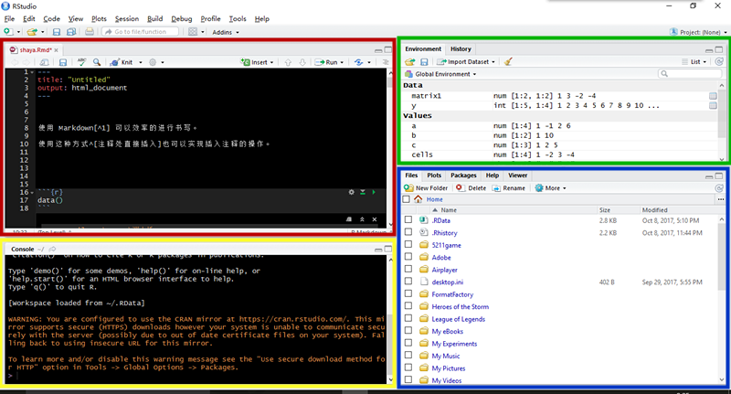
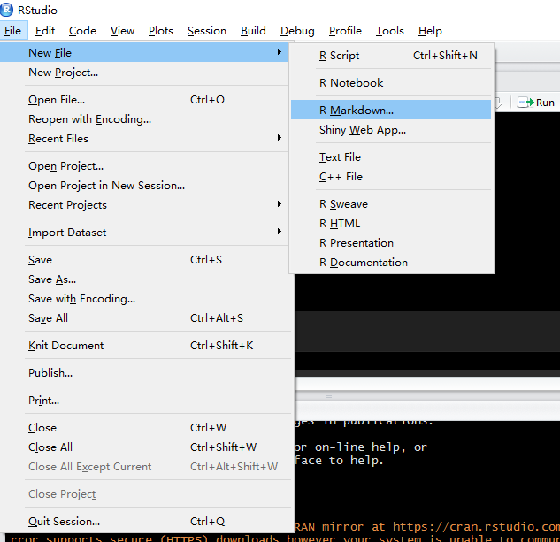
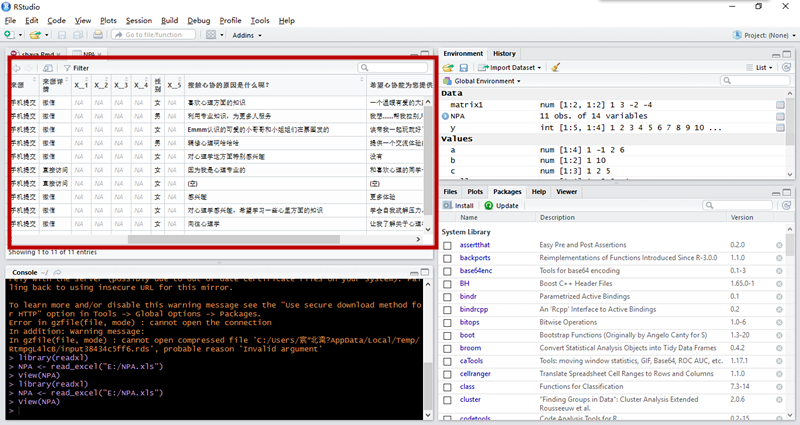
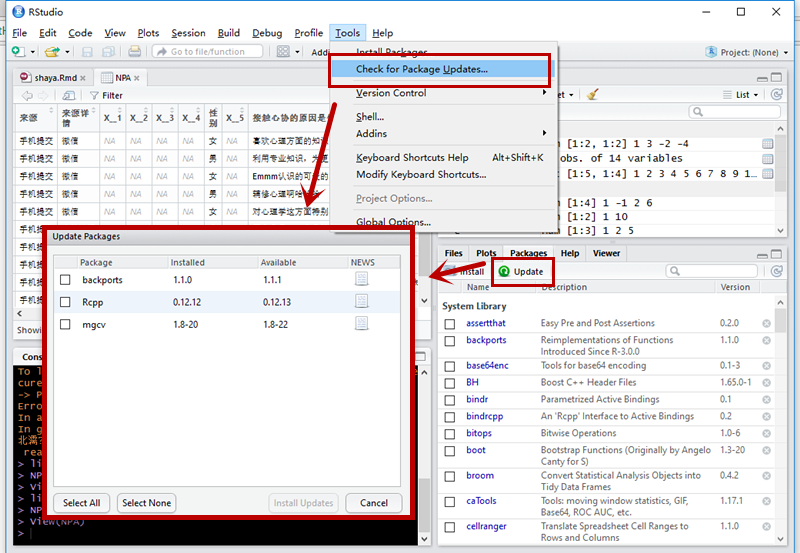
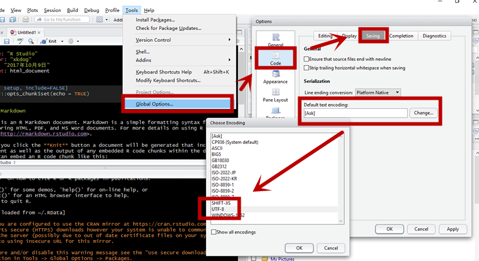
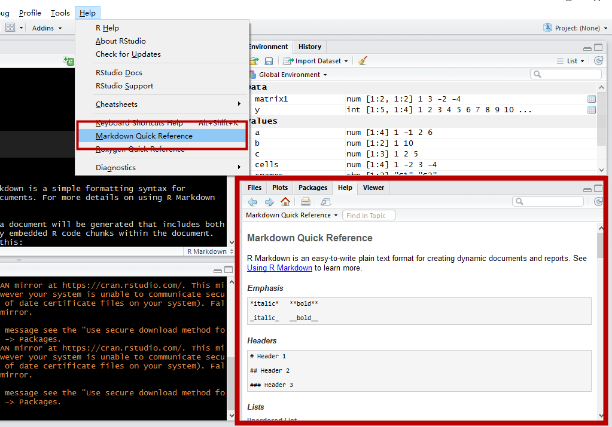
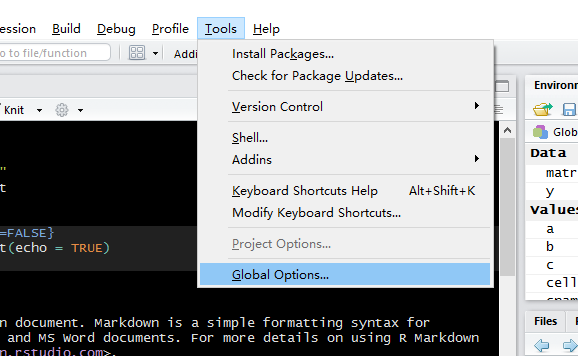
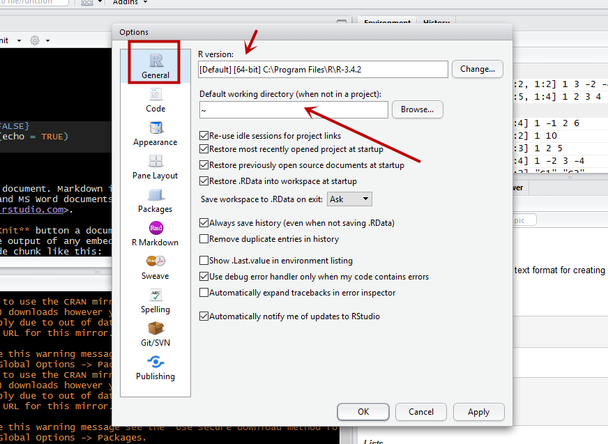
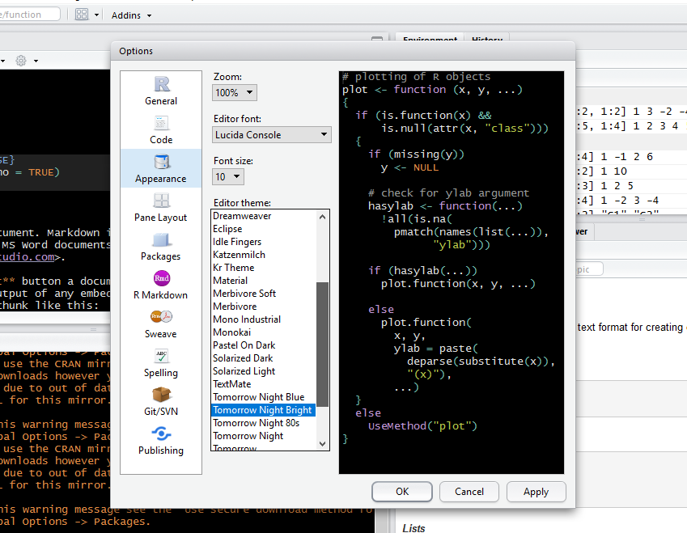
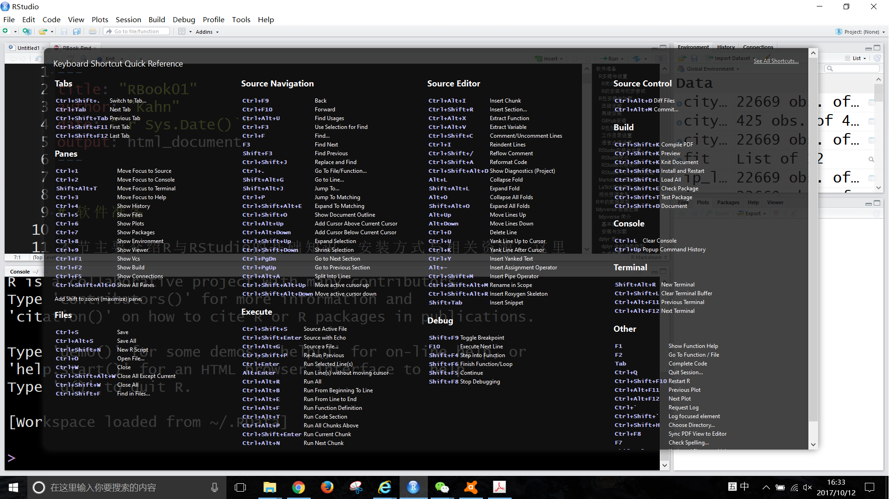

## RStudio 安装与设置

### RStudio 简介

R 虽然是个强大的统计分析软件，但仍欠缺完成数据分析的整体流程所需要的衍生功能。例如，如何满足普通用户对友好操作界面的需求，如何生成可重复、交互性的报告（Word 格式、HTML 格式或其他格式）并与他人共享，如何快速导入其他类型的数据（如 Excel、SPSS、Stata、SAS 等常用数据管理与分析软件格式的数据），等等。这就需要一个更具整合性的操作平台，以更有效率和对普通用户更友好的方式完成数据分析、报告撰写、成果发布等工作。

RStudio 就是一个优秀的 R 集成开发环境 ^[集成开发环境（Integrated Development Environment，IDE）软件是用于程序开发的应用程序，一般包括代码编辑器、编译器、调试器和图形用户界面工具，集成了代码编写、分析、编译、调试、建模等功能的一体化开发软件套。]。它集成了 R、带语法高亮和命令补全的代码编辑器、画图工具、代码调试工具等工作环境，同样提供 Windows、Mac 和 Linux 版本，同时具有免费的开源版本和付费的商业版本供用户选择。个人用户或普通用户选择免费版本即可，具有更高要求的企业用户或高级用户可选择商业版本。RStudio 的开发始于2010年，2011年2月发布测试版，2016年发布1.0.0版本。此后介绍均以 RStudio 1.0.0之后的版本为基础进行演示。

RStudio 的[核心团队](https://www.rstudio.com/about/)包括以首席科学家 [Hadley Wickham](http://hadley.nz/)为代表的其他数据科学家和软件工程师，他们是驱动 R 与数据科学进一步发展和推广的活跃力量，其所开发的诸多 R 包已成为数据分析的最常用工具。

RStudio 可从其[官网](https://www.rstudio.com/products/RStudio/)选择对应系统的版本下载安装。安装选择默认选项即可，注意一般应在安装完 R 后再安装 RStudio。

### RStudio 调试

#### 布局与功能

RStudio 界面由上方的工具栏与下方的四个小窗口组成。

- 左上角的命令区，用来编辑、粘贴命令,窗口上部的小图标是较为常用的几个功能，如保存(`Save current document`)、`Knit`^[Knit 功能可根据数据处理结果生成所需格式的文档，如 HTML、PDF、Word 等。]、运行(`Run`)；
- 左下角的控制区(`console`)^[控制区显示脚本运行结果，亦可直接输入命令，回车运行。]；
- 右下角的功能区，依次为 `Files`(打开本地文件)、`Plots`(显示图形结果)、`Packages`(包的相关功能)、`Help`(帮助)、`Viewer`五个功能；
- 右上角的`Environment`与`History`，分别用来对数据与已运行的命令进行显示和操作。



#### 新建文档类型

在`File`菜单下的`New File`子菜单里可看到所有可新建文档类型，点击`R Script`可新建一个空白文档，此外还有 R Notebook、R Markdown、C++ File 文档等。



#### 数据导入

通过`File`菜单下的`Import Dataset`即可进行数据的导入，可导入 CSV、Excel、SPSS、SAS、Stata 五种格式的文件。导入的文件会在命令区以新窗口的形式呈现。



#### 包的更新

软件使用中经常会有 R 包的更新，可以通过`Tools`菜单下的`Check For Updates`功能检查待更新的 R 包，也可以直接点击右下角`Packages`功能区的`Update`按钮，功能相同。



#### 默认文本编码格式

为了避免打开数据文件时中文变成乱码，需要修改默认文本编码格式，点击`Tools`菜单下的`Global Options`子菜单，在弹出窗口中点击`Code`中的`Saving`，将默认文本编码格式(Default text coding)修改为 UTF-8^[UTF-8(8-bit Unicode Transformation Format)又称万国码,由Ken Thompson于1992年创建,用在网页上可以统一页面显示中文简体繁体及其它语言。]。当打开中文数据时在`File`-->`Reopen with Ecoding`下选择 UTF-8 格式就可以正常显示中文。



#### 速查表

为方便 RStudio 的使用，`Help`菜单内设置了`Cheatsheet `提供速查功能，使用者也可以通过`Help`下`Markdown Quick Reference`功能迅速入门 Markdown 语法。


 
  
对初级用户而言，RStudio 的最初调试只涉及`Tools`菜单下的`Global Options`子菜单。



打开后，在`General`选项中可选择与 RStudio 相关联的 R 版本（如果只安装了一个版本的 R，此步骤可忽略），还可设定当前工作目录（working directory）。



当前工作目录的设置非常重要，稍后继续说明。在`Appearance`选项中可选择字体、字号和背景颜色，可自行尝试调整到个人觉得舒适的配置。




### RStudio 功能简介

为确保能实现 RStudio 的诸多拓展功能，请确保已执行以下命令安装各相关包。

```r
install.packages(c("knitr", "rmarkdown", "bookdown", "xaringan", "shiny"))
```

其中，**knitr** 包和 **rmarkdown** 包可用来将 Rmarkdown 文档转为 HTML 网页、Word 文件或 PDF 文件；**bookdown** 包可用来撰写 Markdown 格式的长文档（书稿）并转为 HTML 网页、Word 文件或 PDF 文件；**xaringan** 可用来制作 HTML5 格式的网页幻灯片；**shiny** 包可用来制作交互式的网页。

安装完毕这些包后，打开 RStudio，点击左上角的新建空白文档图标的向下箭头，可以看到可供选择的新建文档格式包括 R script、R Notebook、R Markdown 等。一般可选择 R Markdown 为基本文档格式。以下如无特殊说明，均以此格式为准进行演示。

如想观察数据，可键入如下命令：
```r
View(mtcars)
```

此时左上方窗口会出现数据结构示意，并可执行数据排序（点击变量名称中的上下箭头按钮）、筛选（点沙漏形状的`Fitler`按钮）等简单功能。


### RStudio 中的常用快捷键
要想流畅运用 RStudio，常用快捷键的使用是必不可少的。下面列举几个较常用的快捷键。

| **功能** | **Windows** | **Mac** |
|:--------:|:----------:|:-------:|
| 控制区清屏 | Ctrl + L | Command + L |
| 新建文档 | Ctrl + Shift + N | Command + Shift + N |
| 打开文档 | Ctrl + O | Command + O |
| 保存当前文档 | Ctrl + S| Command +S |
| 关闭当前文档 | Ctrl + W | Command + W |
| 关闭所有文档 | Ctrl + Shift + W | Command + Shift + W |
| 转换为HTML | Ctrl + Shift + H | Command + Shift + H |
| 运行当前行 | Ctrl + Enter | Command + Enter |
| 运行当前代码块 | Ctrl + Alt +C / Ctrl + Shift + Enter | Command + Alt +C / Command + Shift + Enter |
| 插入空代码块 | Ctrl + Alt + I | Command + Alt + I |
| 补全选中区域空格 | Ctrl + Shift + A | Command + Shift + A |
| 复制 | Ctrl + C | Command + C |
| 粘贴 | Ctrl + V | Command + V |
| 剪切 | Ctrl + X | Command + V |

在 RStudio 内可通过工具栏`Help`/`Tools`-->`Keyboard Shortcuts Help`或快捷键 Alt+Shift+K 来查看所有快捷键，按任意键退出。



