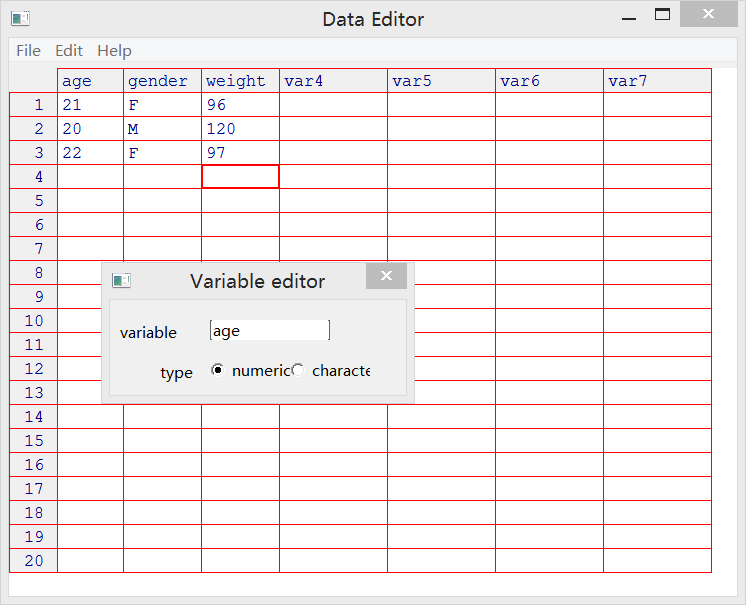

##  R 数据导入

# 目录

* [键盘输入](#键盘输入)
* [导入外部数据](#导入外部数据)
    * [2.1 txt 文档](#21-txt-文档)
    * [2.1 CSV 文档](#21-csv-文档)
* [3 从 excel 文档导入数据](#3-从-excel-文档导入数据)
* [4 导入 SPSS 数据](#4-导入-spss-数据)
* [5 导入 SAS 数据](#5-导入-sas-数据)
    * [5.1 已安装 SAS](#51-已安装-sas)
    * [5.2 未安装 SAS](#52-未安装-sas)
* [6 导入 Stata 数据](#6-导入-stata-数据)
* [7 R 数据导出](#7-r-数据导出)

### 键盘输入

使用 R 内置的文本编辑器，可以弹出类似 Excel 的数据输入界面，但是非常朴素，通常在数据较少时使用。R 中的函数 `edit()` 会自动调用一个可手动输入数据的文本编辑器。步骤如下：

- 创建一个空数据框（或矩阵），其中变量名和变量的模式要与理想中的最终数据集一致

- 针对此数据对象调用文本编辑器，输入数据并将结果保存回此数据对象中

例：创建一个名为 data 的数据框，它含有三个变量： age（数值型）、 gender（字符型）和 weight（数值型）。

```r
data <- data.frame(age = numeric(0), gender = character(0), weight = numeric(0))
data <- edit(data)
```
调用 `edit()` 函数后结果如图：



- 单击列的标题，可以修改变量名与变量类型
- 单击未使用的标题可以添加新的变量
- 编辑器关闭后，结果会保存到之前赋值的对象中，再次调用 `data <- edit(data)` 即可

应注意的是， `edit()` 事实上是在对象的一个副本上进行操作的。如果未将其赋值到一个目标上，所有修改将会全部丢失。

### 导入外部数据

这里先介绍一般性的导入方式，再介绍 Hadley 开发的各类 R 包的导入方式。

####  导入`txt`格式数据

纯文本文档数据（后缀名为`.txt`），可用 `read.table()` 函数，语法如下：

```r
file <- read.table("xxx.txt", header = , sep = "", ...)
```

其中，

- `xxx`表示待读取的文件名
- `header = TRUE`表示将数据第一行读为变量名（默认选项），`header = FALSE`表示不将数据第一行读为变量名
-  `sep = ""`表示分隔符，引号中可填入空格（即`" "`，两个引号之间有一个英文空格）、回车符（`\r`）、换行符（`\n`）、制表符（`\t`）等
- `...`表示其他参数，具体可使用`?read.table()`查询

#### 导入`csv`格式数据

`csv`文档可理解为特殊格式的`txt`文档，其后缀名为`.csv`，意为逗号分隔文件（comma separated values），是常见的通用文件格式，也是跨系统储存数据时的首选文件格式。它可直接使用`read.csv()`函数读取，语法如下：

```r
filename <- read.csv("xxx.csv", )
```

其中，

- `xxx`表示待读取的文件名
- `header = TRUE`表示将数据第一行读为变量名（默认选项），`header = FALSE`表示不将数据第一行读为变量名
-  `sep = ""`表示分隔符，引号中可填入空格（即`" "`，两个引号之间有一个英文空格）、回车符（`\r`）、换行符（`\n`）、制表符（`\t`）等
- `...`表示其他参数，具体可使用`?read.table()`查询


#### 导入 `Excel` 格式数据

对已安装 Office 软件的用户，推荐先将 Excel 文件导出为`csv`文件，再使用`read.csv()`导入。如想直接导入 Excel 格式数据，通常需要安装相关 R 包。

如果已经安装了 Java 环境的用户，传统上可通过安装 **xlsx** 来导入 Excel 数据。但 Java 环境并非由 Windows 平台默认安装，故需用户自行下载安装，稍显繁琐。现在，亦可使用 **openxlsx** 包中的`read.xlsx（）`函数来实现同样功能，此包无须安装 Java 环境。

函数 `read.xlsx()` 将 excel 工作表导入到数据框中，语法：
```
read.xlsx(file, n)
```

*file 是文件名， n 是需要导入的工作表序号*

```{r}
library(openxlsx)
excel <- read.xlsx("LIST.xlsx", sheet = 1)
```

效果如图：


#### 4 导入 `SPSS` 格式数据

- 通过 **foreign** 包中的函数 `read.spss()` 导入到 R 中

 **foreign** 包已被默认安装

- 通过 **Hmisc** 包中的函数 `spss.get()` 导入到 R 中
    - 下载安装 **Hmisc** 包：
    ```
    install.packages("Hmisc")
    ```
    - 使用如下代码导入：
    ```
    libiary()
    spss <- spss.get(spssdata.sav", use.vaule.labels = TRUE)
    ```
    
*spssdata.sav 是要导入的 SPSS 数据文件*

*use.vaule.labels = TRUE 表示让函数将带有值标签的变量导入为 R 中水平对应相同的因子*
 
*spss 是导入 R 后的数据框*

#### 5 导入 `SAS` 格式数据

#### 5.1 已安装 SAS

- **Hmisc** 包中的函数 `sas.get()`

例：导入一个名为 data.sas7bdat 的 SAS 数据集文件，其位于 Windows 系统中 C:/sasdata 文件夹中

代码如下：
```
library(Hmisc)
datadir <- "C:/sasdata"
sasexe <- "C:\...\...\...\..."
sas <- sas.get(libraryName = datadir, name = "data", sasprog = sasexe)
```
*libraryName 是一个包含了 SAS 数据集的文件夹*

*name 是数据集名*

*sasprog 是 SAS 可运行程序的完整路径*

- 将 SAS 数据集保存为 CSV 文件，再用前述方式将其导入到 R 中

#### 5.2 未安装 SAS

- 使用函数 `read.sas7dbat()` 读取 sas7dbat 格式的 SAS 数据集

代码如下：
```
library(sas7dbat)
sas <- read.sas7dbat("C:/sasdata/data.sas7bdat")
```

- 商业软件 Stat/Transfer 可将 SAS 数据集保存为 R 数据框

## 6 导入 `Stata` 数据

简单直接，代码如下：

```
library(foreign)
stata <- read.dta("data.dta")
```

## 7 R 数据导出

- 使用函数 `write.csv()` 将数据导出为 csv 文件

例：
```
write.csv(prac01, "prac01.csv")
```
效果如图：


- csv 文件选择 excel 打开方式即可导出 excel 文档
